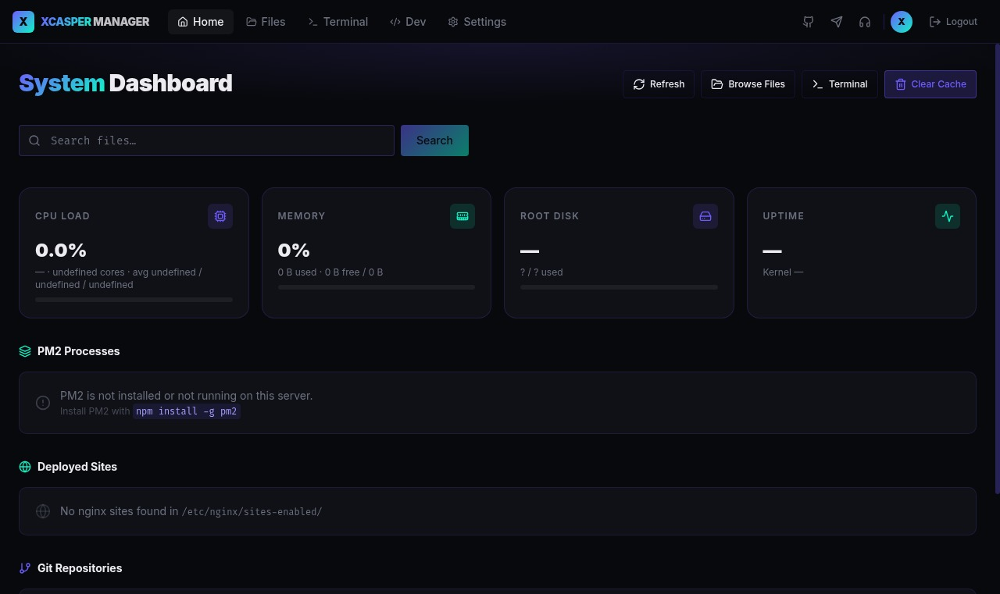

# XCASPER MANAGER

[](LICENSE)
[](https://www.typescriptlang.org/)
[](https://nodejs.org/)
[](https://expressjs.com/)
[](https://react.dev/)

**A self-hosted, browser-based VPS file manager and control panel** — part of the [xcasper.space](https://xcasper.space) brand family by [TRABY CASPER](https://github.com/Casper-Tech-ke).

> *We believe in building together.*

No SaaS. No subscriptions. No telemetry. Deploy it on your own server, secure it with your own API key, and manage your filesystem from anywhere.

> [!IMPORTANT]
> **You must set `API_KEY` in your `.env` file before running the app.**
> This is the key you enter on the login screen. Without it, the server will refuse all requests.
> See [Quick Start → Create a `.env` file](#3-create-a-env-file) below.

---

## Screenshot



---

## Features

| Category | Capability |
|---|---|
| **File Management** | Browse, create, edit, rename, move, delete files and directories (including `/root`) |
| **File Viewer** | Images, video, audio, syntax-highlighted code, plain text — auto-detected by extension |
| **Terminal** | In-browser shell with persistent working directory (`cd` across commands) |
| **System Dashboard** | Real-time CPU (with model), memory (used/free/total), disk, network stats and uptime |
| **PM2 Panel** | Start, stop, restart, and monitor PM2 processes right from the browser |
| **Search** | Filename filter from the home page or directly via `?search=` URL param |
| **Clear Cache** | `sync` + drop Linux page cache (root) or sync-only (non-root) |
| **Authentication** | API-key login; Bearer token auto-injected into all requests via `sessionStorage` |
| **Dev Page** | Developer bio, live GitHub repo card, fork walkthrough, support links |
| **Theming** | Dark xcasper.space theme — purple `#6e5cff`, cyan `#0ff4c6`, bg `#08090d` |

---

## Quick Start

### Requirements

- Node.js 20+ (tested on 24)
- pnpm 9+
- PM2 (for production)

### 1. Clone

```bash
git clone https://github.com/Casper-Tech-ke/vps-manager.git
cd vps-manager
```

### 2. Install dependencies

```bash
pnpm install
```

### 3. Create a `.env` file

> [!WARNING]
> **Never commit `.env` to version control.** It is already in `.gitignore`.

Create a file named `.env` in the **project root**:

```env
# ── Required ────────────────────────────────────────────────────────────────
# The key you type on the login screen. Make it long and random.
# You can rotate it later from the Settings page inside the app.
API_KEY=your-secret-key-here

# Session encryption secret — any long random string works
SESSION_SECRET=any-random-string-here
```

> **Tip:** generate a strong key with `node -e "console.log(require('crypto').randomBytes(32).toString('hex'))"`

### 4. Development

```bash
# Start both servers (API + frontend)
pnpm --filter @workspace/api-server run dev &
pnpm --filter @workspace/vps-manager run dev
```

Open `http://localhost:5173` and sign in with your `API_KEY`.

---

## Deployment with PM2

PM2 keeps the API server alive across reboots and crashes. All PM2 commands are available as pnpm scripts.

### 1. Build for production

```bash
pnpm run build
```

### 2. Start the API server with PM2

```bash
pnpm run pm2:start
```

This runs `build` then launches the process defined in `ecosystem.config.cjs`.

### 3. Serve the frontend (static)

Build the frontend and serve it via nginx (or any static server):

```bash
pnpm --filter @workspace/vps-manager run build
# dist output → artifacts/vps-manager/dist/
```

### 4. PM2 script reference

| Script | Command | What it does |
|--------|---------|-------------|
| `pm2:start` | `pnpm run pm2:start` | Build + start the API process |
| `pm2:stop` | `pnpm run pm2:stop` | Stop the API process |
| `pm2:restart` | `pnpm run pm2:restart` | Hard restart |
| `pm2:reload` | `pnpm run pm2:reload` | Zero-downtime reload |
| `pm2:logs` | `pnpm run pm2:logs` | Tail live logs |
| `pm2:status` | `pnpm run pm2:status` | Show all PM2 process statuses |
| `pm2:save` | `pnpm run pm2:save` | Save process list for auto-restart |
| `pm2:startup` | `pnpm run pm2:startup` | Generate systemd startup hook |
| `pm2:delete` | `pnpm run pm2:delete` | Remove process from PM2 list |

### 5. Auto-restart on server reboot

```bash
# Generate and register the startup hook (run once)
pnpm run pm2:startup

# Save current process list
pnpm run pm2:save
```

### 6. Nginx reverse proxy (recommended)

```nginx
server {
    listen 80;
    server_name your-domain.com;

    # Serve the React frontend (static build)
    root /path/to/vps-manager/artifacts/vps-manager/dist;
    index index.html;

    # SPA fallback
    location / {
        try_files $uri $uri/ /index.html;
    }

    # Proxy API requests to Express
    location /api/ {
        proxy_pass http://127.0.0.1:8080;
        proxy_http_version 1.1;
        proxy_set_header Upgrade $http_upgrade;
        proxy_set_header Connection 'upgrade';
        proxy_set_header Host $host;
        proxy_set_header X-Real-IP $remote_addr;
        proxy_set_header X-Forwarded-For $proxy_add_x_forwarded_for;
        proxy_cache_bypass $http_upgrade;
    }
}
```

---

## ecosystem.config.cjs

The PM2 process config is at the root of the project:

```js
module.exports = {
  apps: [
    {
      name: "xcasper-api",
      script: "./artifacts/api-server/dist/index.mjs",
      interpreter: "node",
      interpreter_args: "--enable-source-maps",
      instances: 1,
      autorestart: true,
      watch: false,
      max_memory_restart: "300M",
      env_production: {
        NODE_ENV: "production",
        PORT: 8080,
      },
      error_file: "./logs/api-error.log",
      out_file: "./logs/api-out.log",
      log_date_format: "YYYY-MM-DD HH:mm:ss Z",
    },
  ],
};
```

---

## Tech Stack

| Layer | Technology |
|---|---|
| **Frontend** | React 18, Vite, TypeScript, TanStack Query, Wouter, Tailwind CSS, shadcn/ui |
| **Backend** | Express 5, TypeScript, esbuild (ESM bundle) |
| **Process Manager** | PM2 |
| **Validation** | Zod v4 (generated from OpenAPI spec via Orval) |
| **Monorepo** | pnpm workspaces |
| **Fonts** | Inter (UI), Fira Code (mono) |

---

## Project Structure

```
vps-manager/
├── artifacts/
│   ├── api-server/          # Express 5 REST API
│   └── vps-manager/         # React + Vite frontend
├── lib/
│   ├── api-spec/            # OpenAPI 3.1 spec + Orval codegen config
│   ├── api-client-react/    # Generated React Query hooks
│   └── api-zod/             # Generated Zod schemas
├── ecosystem.config.cjs     # PM2 process config
├── README.md
├── CHANGELOG.md
├── CONTRIBUTING.md
└── SECURITY.md
```

---

## API Reference

All endpoints are prefixed with `/api` and require `Authorization: Bearer <API_KEY>`.

| Method | Path | Description |
|---|---|---|
| `GET` | `/auth/verify` | Validate API key |
| `POST` | `/auth/logout` | Clear session |
| `GET` | `/system/info` | CPU, memory, disk, network, uptime |
| `POST` | `/system/clear-cache` | sync + drop page cache |
| `GET` | `/files/list?path=` | List directory contents |
| `GET` | `/files/read?path=` | Read file content (max 5 MB) |
| `GET` | `/files/raw?path=` | Stream raw file bytes |
| `POST` | `/files/write` | Write or create a file |
| `DELETE` | `/files/delete?path=` | Delete file or directory |
| `POST` | `/files/mkdir` | Create directory |
| `POST` | `/files/rename` | Rename or move |
| `POST` | `/terminal/exec` | Execute a shell command |
| `GET` | `/pm2/list` | List all PM2 processes |
| `POST` | `/pm2/:name/restart` | Restart a PM2 process |
| `POST` | `/pm2/:name/stop` | Stop a PM2 process |

---

## Links

- **Support**: [support.xcasper.space](https://support.xcasper.space)
- **Sponsor**: [payments.xcasper.space](https://payments.xcasper.space)
- **GitHub**: [github.com/Casper-Tech-ke](https://github.com/Casper-Tech-ke)
- **Telegram**: [t.me/casper_tech_ke](https://t.me/casper_tech_ke)

---

## Contributing

See [CONTRIBUTING.md](CONTRIBUTING.md) for the fork workflow, branch naming, and PR checklist.

## Security

See [SECURITY.md](SECURITY.md) for responsible disclosure instructions.

## License

[MIT](LICENSE) — Copyright 2025 TRABY CASPER / Casper-Tech-ke
